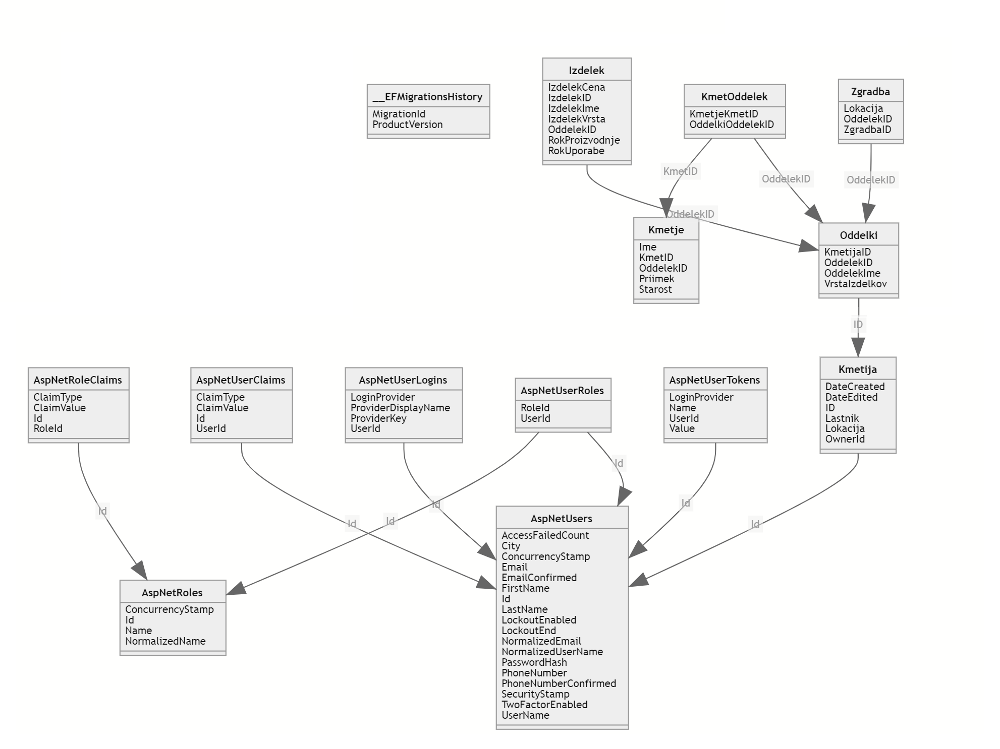
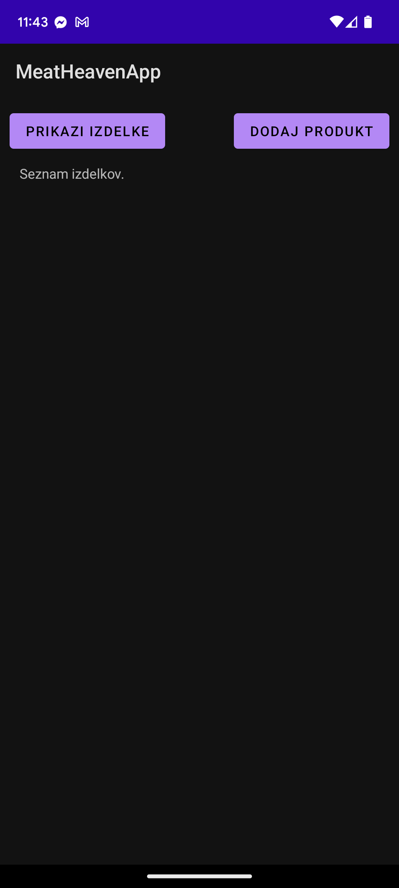
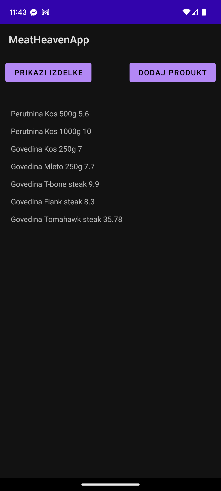
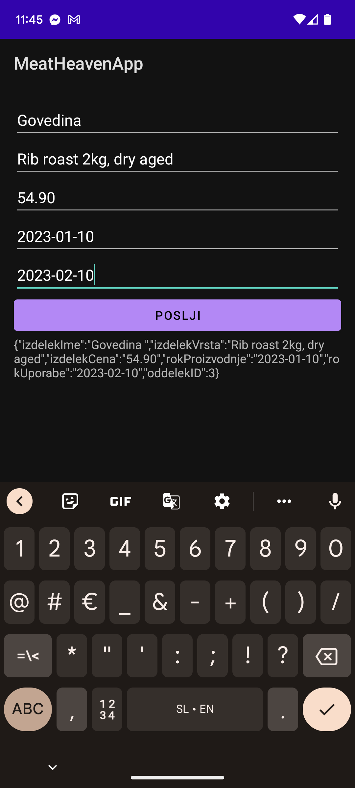
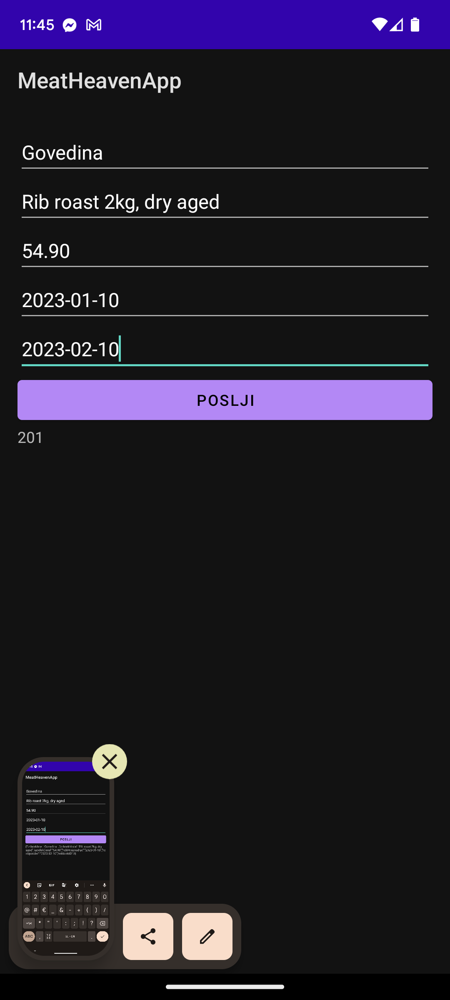
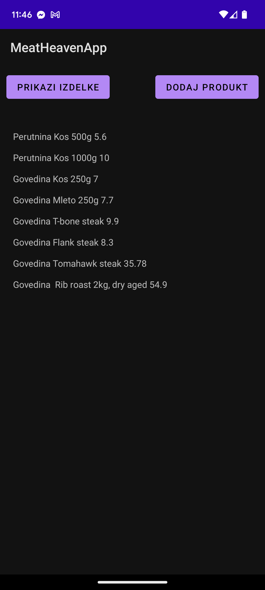

# Meat Heaven

63210312 Mitjan Stepančič

63190277 David Šeruga

## Uvod

### Ideja
V današnjih časih je postalo zelo pupolarno, da ljudje kupujejo čim več lokalno pridelane hrane. Prav tako ljudje kupujejo Slovensko rejeno meso. Nekaj take ponudbe že ima Maxi market v Ljubljani.

Midva pa bi rada trg pripeljala lokalnim kmetom. Da bodo lahko oni direkno naprej prodajali svoje meso in se tako na nek način znebili posrednikov.

Tukaj v pomoč pride informacijski sistem Meat Heaven, ki omogoča prav to. Povezuje lokalne živinorejce s kupci. Kmetje bodo lahko svoje meso objavil na spletno trgovino, stranke pa bodo med različno ponudbo mesa prosto brskale. 
Prav tako bodo lahko stranke poslale povpraševanje po specifičnih kosih mesa, kot tudi shranile izdelke, s katerimi so po nakupu zadovoljne, za ponoven nakup.

### Funkcionalnosti
Kmetje se lahko prijavo in objavijo svojo ponudbo. Za to ponudbo bi bilo priporočljivo, če jo klasificirajo, da jo lahko ljudje, ki iščejo kaj specifičnega, lažje najdejo

Klasificirali bi lahko svoje meso po:
- vrsti mesa (perutnina, svinina, govedina, ...)
- tipu mesa (pečenka, kos mesa, mleto meso, mesni izdelek, ...)
- kosu mesa (bedro, prsa, svinjski kare, rib-eye, ...)
- hranjenje mesa (sveže, zamrznjeno)

Uporabniki pa bi lahko iskali svoje meso po:
- vrsti, tipu, kosu mesa
- kmetiji
- hranjenju
- ceni

To uporabnikom omogoča dobr pregled nad ponudbo in lažje iskanje specifičnega artikla. Živinorejcem pa omogoča, da imajo lepo urejene svoje izdelke in vse pod kontrolo.

### Primeri trenutnih podobnih praks

Slovenski primeri:
- Zagriz (zagriz.si)
- CoolHouse (coolhouse.si/spletna_trgovina/meso/)
- Poljanska tržnica (poljanska-trznica.si/domace-mesarstvo/sveze-meso/)
- ...

Tuji primeri:
- Good Ranchers (goodranchers.com)
- Crowd Cow (crowdcow.com)
- Grand Western Steaks (grandwesternsteaks.com)
- ...

## Sistem

### Spletna aplikacija (Mitjan)

#### Spletna aplikacija

Da začneva izdelovati našo spletno aplikacijo prvo potrebujeva nekaj programske opreme. Potrebujeva:
- Docker Desktop in
- Microsoft SQL Server 2019

Ko imava te stvari lahko nadaljujeva tako, da nekatere stvari zaženeva in namestiva.
- Zaženeva MS SQL Server docker container
- Zaženeva Azure SQL Edge
- Namestiva dotnet-ef
- Namestiva dotnet-aspnet-codegenerator
- Dodava package reference v `.csproj`
- Ustvariva connection string na podatkovno bazo
- Generirava MVC
- Migrirava in posodobiva podatkovno bazo

Sedaj morava razširiti najino obstoječo MVC aplikacijo. Tukaj dodava knjižnici `Microsoft.AspNetCore.Identity.EntityFrameworkCore` in `Microsoft.AspNetCore.Identity.UI`.

Zdaj ko imava knjižnici dodani, lahko ti uporabiva, da v najinem direktoriju `Models` ustvariva novo datoteko z imenom `ApplicationUser.cs`, ki bo dedovala razred `IdentityUser` iz knjižnjic, ki sva jih prej uvozila.
Posodobiva tudi datoteko `SchoolContext.cs`, tako da tudi ta uporablja najine nove knjižnice.

Zdaj pa ustvariva migracije in jih izvedeva na bazo. Potem pa še zaženeva generator kode za Identity.

Ko sva to naredila morava popraviti naš `Program.cs` tako da:
- Uvoziva `web.Models`,
- Nastaviva `connectionString`,
- Odstraniva stari `.addDbContext`,
- Prilagodiva `RequireConfirmedAccount`,
- Prilagodiva `.AddRoles<IdentityRole>()` in
- Dodava `app.MaprazorPages()`

Dodati morava tudi avtorizacijo na določene metode, ki se nahajajo v datotekah `IzdelkiController.cs` in `KmetijeController.cs`.
V `Kmetija.cs` popraviva razred, tako da ga razširiva z lastnostmi: `Owner`, `DateCreated`, `DateEdited`.

Od tu naprej morava našo apliacijo dopolniti še tako da:
- Posodobiva podatkovno bazo,
- Dodava tri različne vloge v tabelo `AspNetRoles`,
- Omejiva dostop do operacij v `CourseController.cs` in
- Za vnos podatkov o uporabniku vlogah in povezavi med uporabnikom ter vlogo dopolniva `DbInitializer.cs`
 

#### Objava apliacije v oblaku, Azure
Da objaviva aplikacijo v oblak slediva parim korakom.
1. Ustvariva SQL server in podatkovno bazo na strežniku.
2. Konfigurirava požarni zid na strežniku SQL, da omogoča dostop iz razvojnega okolja.
3. Ustrezno urediva povezavo do podatkovne baze.
4. Objaviva produkcijsko spletno aplikacijo preko lokalnega git repozitorija.
5. Objaviva razvojno spletno aplikacijo preko GitHub repozitorija.

### Podatkovna baza (Mitjan)

### Spletna storitev (David)

#### API

Najino spletno aplikacijo smo že pod oddelkom **Spletna aplikacija** objavila v oblak *Microsoft Azure*. 

Center tega pod področa je bil API, ki smo ga izdelala. Za to, da sva tega razvila je bilo potrebno pripraviti okolje. Na githubu sva ustvarila nov problem (*Issue*), kjer sva predlagala ustvarjanje API-ja. Ustvarila sva tudi nov branch *api*, ki je bil uporabljen za razvoj. Ta branch je bil nekaj časa tudi uporabljen kot production, zaradi testiranja določenih stvari.

Da sva ustvarila API sva zgenerirala 2 `Controller`ja tipa `API` za entiteti `Izdelki` in `Kmetije`. 
V teh kontrolerjih sva tudi popravila njihov `route`, ki smo ga nastavila na `api/v1/[controller]`
Dodala sva tudi dokumentacijo za najin Web API. To sva ustvarila, tako da sva dodala nov paket `Swashbuckle.AspNetCore`. In nato dodala storitev `Swashbuckle` v najin `Program.cs`. Po tem je bila najina dokumentacija API-ja dostopna na najinem naslovu z dodanim `/swagger`.
 

#### Avtentikacija/avtorizacija vmesnika API

Naš API je v tem trenutku še ne zavarovan in vsak ki pozna našo API povezavo, lahko do teh podatkov dostopa in morda še huje. Lahko sam dodaja podatke.

Zato moramo naš API zavarovati s *ključem* oz. geslom, da ko oddajamo naše zahtevke pripnemo ta ključ zraven in nam je storitev omogočena, drugače pa bi nam bila zavrnjena.

Začenmo tako da ustvarimo direktorij `Filters` znotraj direktorija `web`. V tem direktoriju usvarimo nov filter, ki je datoteka z imenom `ApiKeyAuthAttribute.cs`.

V tej datoteki sva ustvarila razred `ApiKeyAuthAttribute`, kjer ustvariva ime glave za *ApiKey* in jo poimenujeva kar `ApiKey`. Ta razred tudi pridobi vrednosti tega polja in ga preveri, ter vrne nov `UnauthorizedResult`, če se ključa ne ujemata.

Ključ pa nastavimo v datoteki `appsettings.json` na vrednost `"ApiKey": "SecretKey"`.

Seveda pa moramo to avtentikacijo tudi omogočiti znotraj samega kontrolerja, kjer API deluje. To naredimo tako, da nad razred kontrolerja dodamo vrstico `[ApiKeyAuth]`.

Zdaj lahko do našega API-ja dostopajo samo tisti, ki imajo pravi ključ za dostop.

### Odjemalec Android (David)

#### Android GET

Android aplikacijo smo izdelali v okolju *Android Studio*, ki stoji na platformi *IntelliJ IDEA*. Android aplikacijo pa sva razvijala v programskem jeziku *Java*.

Aplikaciji smo prvo omogočili dostop do interneta, tako da smo ji dodali `android.permission.INTERNET`.
Uvozili smo tudi knjižnico *volley*

V tej točki smo na ekran začeli dodajati elemente. Dodala sva dva elementa. En gumb in eno tekstovno polje. Ta elementa smo pravilno poravnali in sedaj sledi programiranje njihovih funkcionalnosti. Te bomo dodali v datoteki `MainActivity.java`.

Prvo uvozimo veliko različnih stvari, nato pa ustvarimo nekaj globalni spremenljivk, ki se nanašajo na elemente, povezave in na poizvedbe.

Ustvarimo funkcijo `prikaziIzdelke()`, ki poskrbi, da ob kliku na naš gumb pridobimo podatke iz našega API-ja, ter te podatke prikažemo. Zato, da to naredimo moramo tudi popraviti funkcijo `onResponse()`, ki se nahaja v razredu `Response.Listener`, ki pa ga potrebujemo, da lahko ustvarimo objekt `jsonArrayListner`, ki ga potrebuje razred `JsonArrayRequest`, da lahko naredi poizvedbo.

Po vsem tem, nam aplikacija prikazuje izelke, ki jih pridobi preko API-ja, ki smo ga naredili.
 

#### Android POST

V tem delu moramo omogočiti dodajanje izdelkov v našo bazo preko API-ja, ki je spisan. Da bomo to naredili rabimo dodati en gumb na naš osnovi ekran, ki nas bo odpeljal na nov ekran v aplikaciji in tam ustvariti en form, ki pa bo poskrbel, da lahko dodamo ta izdelek.

Na ekran dodamo nov gumb in ga ustrezno popravimo, nato pa moramo v datoteko `MainActivity.java` dodati tudi funkcijo `addProduct()`, ki pa nas bo odpeljala na naš nov ekran.

Da pa nas lahko odpelje tja, moramo tudi ustvariti ta naš nov ekran. Ko ga ustvarimo dodamo vanj elemente, ki skupaj sestavijo nek form.
Dodamo 5 polj za urejanje besedila, gumb in eno polje za prikaz besedila.
Teh 5 polj za urejanje pričakujejo podatke kot so:
- Ime produkta,
- Vrsta produkta,
- Cena produkta,
- Datum proizvoda in
- Rok uporabe

Zdaj pa je potrebno ta form sprogramirati, da bo lahko pošiljal podatke preko našega API-ja na server

V datoteko `AddProduct.java` spet uvozimo veliko različnihi stvari, ki jih potrebujemo.
V našem razredu `AddProduct` pa imamo samo dve funkciji. To sta `onCreate()`, s katero poskrbimo za vse elemente ter `addProduct()`, ki pa je glavna funkcija pri tej operaciji. Pokliče se, ko na ekranu kliknemo gum *Poslji*.

V tej funkciji prvo pridobimo vse vrednosti iz naših tekstovnih polj in naknadno še zgeneriramo dodatne vrednosti, ki pa jih potrebujemo za shranjevanje v bazo. Vse te vrednosti shranimo v objekt `jsonBody`.

Ta naš objekt na koncu pretvorimo v `String` in ga uporabi razred `StringRequest` iz katerega zgeneriramo objekt `stringRequest`, ki pa ga dodamo v `requestQueue`, kjer se izvede.

Tako lahko dodajamo izelke na naš server preko API-ja.
 

#### Avtorizirani zahtevki na API

Zdaj pa potrebujemo tudi prilagoditi našo aplikacijo, da bo delovala z novo potrebno avtentikacijo na API-ju. Popraviti potrebujemo dve datoteki; `MainActivity.java` in `AddProduct.java`.

V datoteki `MainActivity.java` popravljamo funkcijo `prikaziIzdelke` ampak bolj specifično. Popravljamo razred `JsonArrayRequest`, v katerem popravimo funkcijo `getHeaders()`, kjer ji rečemo, da more dodati nov parameter `ApiKey` z vrednostjo ključa, ki je `SecretKey`.

Potem pa v drugi datoteki zelo podobno stvar, kjer v funkciji `addProduct()` popravljamo razred `StringRequest`, v katere popravljamo funkcijo `getHeaders()`, ki jo popravimo na isti način, tako da dodamo ta nov parameter.

In po teh majhnih popravkih, naša aplikacija pravilno deluje.
 

#### Slike aplikacije
Tukaj so še zaslonske slike Android aplikacije zajete na mojem telefonu *Google Pixel 6a*.

To je slika praznega glavnega zaslona in glavnega zaslona s prikazanimi izdelki.

To je slika zaslona za dodajanje izdelkov in potrditve da si izdelki dodani.

In to je še slika glavnega zaslona z novimi izdelki.

